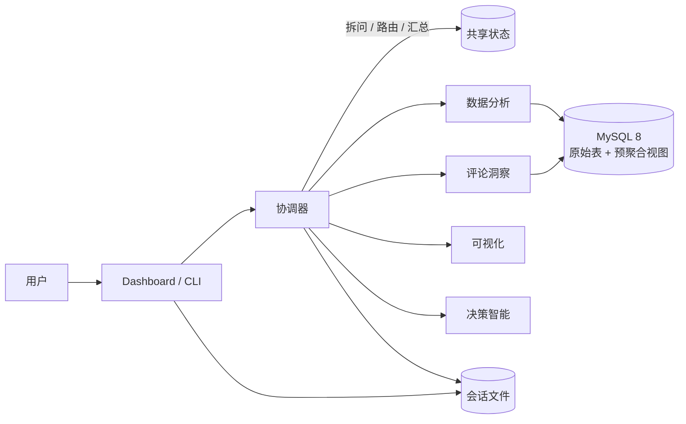
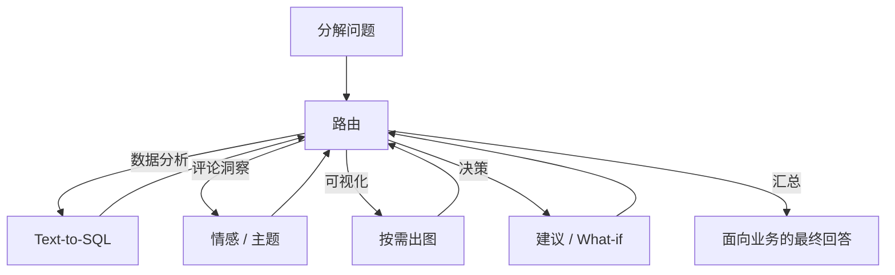

# Agentic BI 驱动的多表电商运营分析与决策智能系统

面向电商运营分析与决策支持：用自然语言完成跨表指标统计、原因下钻与趋势观察，并按需输出图表与可落地的运营建议。


---

## 项目介绍

本系统基于巴西 [Olist](https://www.kaggle.com/datasets/olistbr/brazilian-ecommerce) 电商公开数据（约 11 万订单、9 张业务表，2016–2018），把自然语言问题编排为多智能体协作流程：先拆问与路由，再按需查数、出图、分析评论，最后在证据齐备后给出建议。

它针对三类常见痛点：

- 非技术人员难以直接查询多表关联数据
- 传统看板只能被动看数，无法按问题动态分析
- 诊断结论与运营建议缺乏可核对的上游证据

业务人员可以这样提问：「2017 年哪个州的销售额最高？」「人们对某品类的评价如何，入行是否有前景？」「那 SP 州呢？」系统会补齐指代、调度相应能力，并返回面向业务的中文结论。

---

## 系统架构

协调器是唯一编排入口。各子 Agent 不互相调用，只通过共享状态交换结构化结果；页面与命令行共用同一套会话存储。



调度不是固定流水线，而是「分解 → 每轮只调一个子 Agent → 写回状态 → 再路由」：



路由由模型提议，代码做最终裁决：查数未完成或建议名单未跑完不得汇总；评论洞察须先于出图。提议失败时回退到同一套依赖规则，避免尚未查清就给出运营建议。

---

## 技术栈

### 核心依赖

| 技术 | 版本 | 说明 |
| --- | --- | --- |
| Python | ≥ 3.11 | 运行时 |
| LangChain | 1.4 | LLM 调用、结构化输出、工具封装 |
| LangGraph | 1.2 | 协调器状态图（分解 / 路由 / 子 Agent / 汇总） |
| DeepSeek / 通义千问 | deepseek-v4-flash / qwen3.8-max | 默认与可选模型，侧边栏可切换 |
| MySQL | 8.0 | 原始表、NLP 衍生表、预聚合视图 |
| PyMySQL | 1.2 | 在线只读查询与灌库 |
| pandas / matplotlib / seaborn / wordcloud | — | 结果整理与图表渲染 |
| Streamlit | 1.63 | 多轮会话界面 |
| Pydantic | 2.13 | 路由、会话解析、决策契约 |

离线评论灌库另装 `requirements-nlp.txt`（pysentimiento、BERTopic 等）；在线路径只读已灌好的表，不加载这些模型。

### 选型说明

1. **为什么用确定性状态图，而不是开放循环 Agent？**  
   电商 BI 有明确依赖（先查数，再出图 / 建议）。开放循环容易在证据不足时直接编结论。本仓库把「下一步只调谁」做成可校验的路由枚举，非法选择由代码覆盖。

2. **为什么用 MySQL 虚拟视图做预聚合？**  
   高频分析口径（月度 GMV、分州销售、配送准时率等）写成视图，生成 SQL 时优先命中视图，否则回退原始表。虚拟视图随基表更新，无需单独刷新物化结果；价值主要在于约束查询模式，避免相关子查询等低效写法。

3. **为什么会话落磁盘而不是外部检查点 / 向量记忆？**  
   命令行与页面读写同一目录即可跨进程续聊，不引入 Redis 或向量库。写入模型的是滚动业务摘要和近几轮问答，而不是完整工具轨迹。

4. **评论洞察为什么离线灌库、在线只聚合？**  
   全量情感 / 主题推理无法放进一次用户请求。离线写入衍生表后，在线路径做聚合 SQL，毫秒级返回结构化洞察。

---

## 功能特性

### 多智能体编排

- **问题分解**：复合问法拆成可独立查数的子问题，并识别描述 / 诊断 / 预测 / 决策 / What-if 等意图。
- **迭代路由**：每轮只调度一个子 Agent，结果写回共享状态后再决定下一步。
- **规则护栏**：查数未完禁止汇总；评论须先于出图；越界或注入式提问直接拒绝，不进入编排。
- **证据汇总**：最终回答只保留关键数值、趋势与建议，过滤 SQL 日志、文件路径等噪声。

### 数据分析（Text-to-SQL）

- **视图优先**：命中月度 / 州 / 品类 / 配送 / 卖家 / 支付等预聚合视图则直接查询；维度不覆盖时 JOIN 原始表。
- **生成链路**：转写 → 生成 SQL → 只读校验 → 执行；失败把错误写回上下文并自动重试。
- **安全约束**：仅允许只读查询；结果写入 CSV，明细不进入模型上下文。
- **口径约束**：视图粒度与问题粒度不匹配时强制回退原始表（例如全平台准时率不能对「月 × 州」比率再取平均）。

### 智能可视化

- **按需出图**：根据问题与已有查数结果规划要不要图、几张、数据从哪来；纯数值问题可跳过。
- **类型覆盖**：折线、柱状 / 条形、热力、散点 / 气泡、地理气泡、词云等。
- **复用与补查**：优先复用已有 CSV；缺维度时追加查数，而不是固定刷一套模板图。
- **预测展示**：可在历史 GMV 折线上叠加短期预测与区间。

### 评论洞察

- **结构化输出**：情感分布、主题分布、品类交叉、好评 / 差评词云数据，供出图与决策直接消费。
- **在线不调 LLM**：读情感 / 主题表或关键词词典聚合；BERT 类模型只用于离线灌库。
- **触发条件**：诊断 / 决策类问题，或问句涉及评论、差评、满意度时调度。

### 决策智能

- **证据契约**：只消费上游查数、评论、预测等结构化结果，不直接查原始库，不编造未证实事实。
- **行动建议**：识别物流、卖家、品类、区域等问题并排出优先级，输出可核对的建议叙述。
- **What-if**：在有基线与假设时做加减 / 倍率 / 百分点模拟；缺输入则标明缺口，不用臆测数字填洞。
- **失败降级**：叙述层模型失败时回退规则摘要，链路不中断。

### 多轮会话与实时反馈

- **语义补齐**：用会话摘要和近几轮要点解析「那 SP 州呢？」这类追问，形成可执行任务后再编排。
- **解析失败即停**：有历史上下文但无法可靠补齐时，向用户澄清，不用规则拼接问题继续跑。
- **进度推送**：拆问、路由、工具完成等步骤经事件流推到页面，可查看本轮执行过程。
- **持久化**：会话落在 `runtime/sessions/`，命令行与 Dashboard 共用；刷新页面后仍可续聊。

### Web 界面

- 侧边栏：新建 / 切换 / 删除会话，切换 DeepSeek 与通义千问，开关思考模式。
- 中间栏：对话、实时进度时间线、最终回答。
- 右侧栏：按提问轮次展示图表，支持放大与下载。

---

## 数据层

9 张原始表覆盖订单全链路：订单、明细、商品、客户、卖家、支付、评论、地理坐标、品类翻译。在此之上提供 6 个预聚合视图，供高频分析优先命中：

| 视图 | 粒度 | 用途 |
| --- | --- | --- |
| `mv_monthly_sales` | 年-月 | 月度销售趋势、GMV、客单价 |
| `mv_state_sales` | 年-月-州 | 各州销售额与客户数 |
| `mv_category_sales` | 年-月-品类 | 品类表现与均价 |
| `mv_delivery_perf` | 年-月-州 | 配送天数、准时率、延迟单 |
| `mv_seller_perf` | 年-月-卖家 | 卖家 GMV、订单量、评分 |
| `mv_payment_dist` | 年-月-支付类型 | 支付方式与分期 |

视图定义、建表与灌库入口见 `utils/schema.sql` 与 `python utils/setup.py`。视图说明见 [`docs/README_VIEWS.md`](docs/README_VIEWS.md)。

---

## 项目结构

```
├── agents/
│   ├── common/              # LLM 工厂、配置路径、Prompt 拼装
│   ├── coordinator_agent/   # 拆问、迭代路由、汇总、会话与 SSE
│   ├── sql_agent/           # Text-to-SQL（视图优先，否则原始表）
│   ├── viz_agent/           # 按需规划并渲染图表
│   ├── nlp_agent/           # 评论情感 / 主题洞察
│   └── decision_agent/      # 规则 + LLM 决策 / What-if
├── config/                  # 各 Agent Prompt、视图元数据、护栏
├── dashboard/               # Streamlit 多轮会话界面
├── utils/                   # 建库、导 CSV、刷新视图、基准脚本
├── data/                    # Olist 原始 CSV（需自行放入）
├── deploy/                  # MySQL Docker Compose
├── docs/                    # 视图说明与性能对比等
├── db_env.py                # 数据库连接（只读环境变量）
└── runtime/                 # 会话与运行产物（不入库）
```

各 Agent 的输入输出与独立入口见对应目录下的 `readme.md`。

---

## 快速开始

环境要求：

| 依赖 | 版本 | 必需 | 说明 |
| --- | --- | --- | --- |
| Python | ≥ 3.11 | 是 | 推荐 conda 创建独立环境 |
| MySQL | 8.0 | 是 | 可本机安装，或用仓库内 Docker Compose |
| LLM API Key | — | 是 | `DEEPSEEK_API_KEY` 或 `DASHSCOPE_API_KEY` |
| Olist CSV | — | 是 | 放入 `data/` 后执行灌库 |

### 1. 克隆与安装

```bash
git clone https://github.com/ycc250303/Agentic-BI-Driven-Multi-Table-E-Commerce-Operations-Analysis-and-Decision-Intelligence-System.git
cd Agentic-BI-Driven-Multi-Table-E-Commerce-Operations-Analysis-and-Decision-Intelligence-System

conda create -n agentic_bi python=3.11 -y
conda activate agentic_bi
pip install -r requirements.txt
```

仅在需要离线重训情感 / 主题模型时：

```bash
pip install -r requirements-nlp.txt
```

### 2. 配置环境变量

复制 `.env.example` 为 `.env`，至少填写当前 LLM 提供商的 Key 与 MySQL 连接：

```bash
cp .env.example .env
```

```bash
DEEPSEEK_API_KEY=your_api_key
# 可选：通义千问（Dashboard 可切换；模型固定 qwen3.8-max）
# DASHSCOPE_API_KEY=your_dashscope_key
# AGENTIC_BI_LLM_PROVIDER=qwen

AGENTIC_BI_DB_HOST=127.0.0.1
AGENTIC_BI_DB_PORT=3306
AGENTIC_BI_DB_NAME=agentic_bi
AGENTIC_BI_DB_USER=agentic_bi
AGENTIC_BI_DB_PASSWORD=your_password
```

连接参数只来自环境变量 / `.env`，代码中不硬编码主机或密码。

### 3. 启动 MySQL（可选）

若本机尚无 MySQL，可用 [`deploy/docker-compose.yml`](deploy/docker-compose.yml)：

```bash
cd deploy
# 按需修改 MYSQL_DATABASE / MYSQL_USER / MYSQL_PASSWORD，并与 .env 中 AGENTIC_BI_DB_* 对齐
docker compose up -d
```

更完整的容器说明见 [`deploy/readme.md`](deploy/readme.md)。

### 4. 准备数据并灌库

将 Olist 原始 CSV 放到 `data/`，文件名需与脚本一致：

- `olist_orders_dataset.csv`
- `olist_order_items_dataset.csv`
- `olist_products_dataset.csv`
- `olist_customers_dataset.csv`
- `olist_sellers_dataset.csv`
- `olist_order_payments_dataset.csv`
- `olist_order_reviews_dataset.csv`
- `olist_geolocation_dataset.csv`
- `product_category_name_translation.csv`

```bash
python utils/setup.py          # 建库 + 导 CSV + 刷新 6 个预聚合视图
```

可选：先建 NLP 衍生表，再离线灌情感 / 主题（库中已有数据可跳过）：

```bash
python utils/setup.py nlp-tables
python -m agents.nlp_agent.tools.sentiment --backfill
python -m agents.nlp_agent.tools.topic_model --backfill
```

### 5. 运行

**Dashboard（推荐）：**

```bash
streamlit run dashboard/app.py
```

**单轮编排：**

```bash
python -m agents.coordinator_agent.run --query "2017年哪个州的销售额最高？"
```

**多轮会话：**

```bash
python -m agents.coordinator_agent.run_session --new --query "人们对家居舒适类产品的评价如何？入行此类产品是否有前景？"
python -m agents.coordinator_agent.run_session --session-id "<session_id>" --query "那 SP 州呢？"
python -m agents.coordinator_agent.run_session --new --query "..." --sse
```

**测试（在仓库根执行）：**

```bash
pytest agents/common/tests agents/coordinator_agent/tests agents/sql_agent/tests agents/decision_agent/tests agents/viz_agent/tests dashboard/tests -q
```

---

## 使用场景

| 角色 | 可以做什么 |
| --- | --- |
| 运营 / 分析 | 用自然语言查 GMV、州排名、品类趋势、配送准时率、支付结构 |
| 品类 / 商家运营 | 结合差评主题与评分，看问题集中在物流、品质还是履约 |
| 决策支持 | 在查数与评论证据齐备后，要改进建议或有限的 What-if 推演 |

示例问题：

- 2017 年哪个州的销售额最高？交付准时率是多少？
- 哪些品类近期在下滑？差评主要集中在什么主题？
- 如果缩短配送时长，准时率大概会怎么变？

---

## 许可证

[MIT License](LICENSE)
