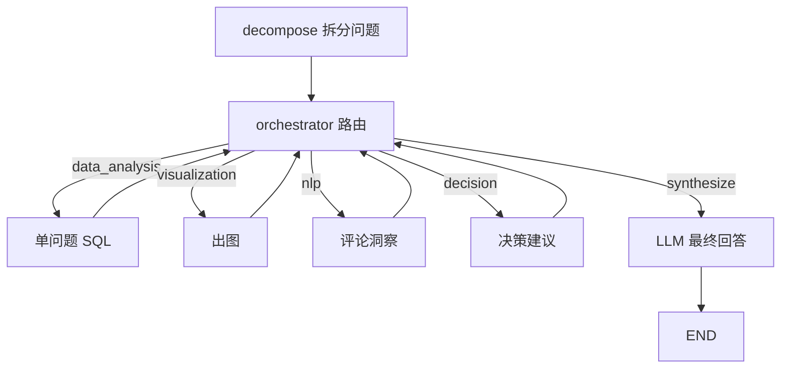

# 协调器 Agent（Coordinator / Orchestrator）

解析用户问题 → **拆分为多个单问题** → **迭代式**调度子 Agent → **LLM 撰写**面向业务的 `final_answer`。

## 核心设计

1. **问题分解**（`decompose`）：复合问法拆成多条 `sub_questions`，每条单独交给数据分析 Agent
2. **迭代路由**（`orchestrator`）：由 LLM（规则兜底）根据当前进度决定**下一步只调用一个** Agent
3. **最终汇总**（`synthesize`）：LLM 根据结构化证据输出干净回答，不含 CSV/列画像/重复视图提示等技术噪声

## 调度流程（非固定流水线）



## 快速运行

```bash
# 完整编排
python -m agents.coordinator_agent.run --query "2017年哪个州的销售额最高？"

# 只看问题拆分
python -m agents.coordinator_agent.run --decompose-only --no-llm-plan --query "2017年哪个州的销售额最高？交付准时率是多少？"

# 完整 state
python -m agents.coordinator_agent.run --query "..." --full-state
```

## 代码入口

```python
from agents.coordinator_agent import run_coordinator

state = run_coordinator("分析平台运营并给出策略建议。")
print(state["sub_questions"])
print(state["execution_log"])
print(state["final_answer"])
```

## 配置

| 文件 | 用途 |
|------|------|
| `config/coordinator_agent/decompose_query.md` | 问题分解提示词 |
| `config/coordinator_agent/route_next.md` | 迭代路由提示词 |
| `config/coordinator_agent/synthesize_answer.md` | 最终回答撰写提示词 |

## 测试

```bash
pytest agents/coordinator_agent/tests/ -q
```
