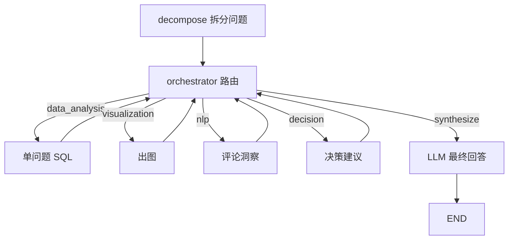

# 协调器 Agent（Coordinator / Orchestrator）

解析用户问题 → **拆分为多个单问题** → **迭代式**调度子 Agent → **LLM 撰写**面向业务的 `final_answer`。

## 核心设计

1. **问题分解**（`decompose`）：复合问法拆成多条 `sub_questions`，每条单独交给数据分析 Agent
2. **迭代路由**（`orchestrator`）：由 LLM 根据当前进度决定**下一步只调用一个** Agent
3. **最终汇总**（`synthesize`）：LLM 根据结构化证据输出干净回答，不含 CSV/列画像/重复视图提示等技术噪声

## 调度流程（非固定流水线）



## 快速运行

```bash
# 完整编排
python -m agents.coordinator_agent.run --query "2017年哪个州的销售额最高？"

# 只看问题拆分
python -m agents.coordinator_agent.run --decompose-only --no-llm-plan --query "2017年哪个州的销售额最高？交付准时率是多少？"

# 完整 state
python -m agents.coordinator_agent.run --query "..." --full-state
```

## 多轮 Session

新增 session manager CLI，支持新建会话、自动保存、选择已有会话继续追问，并输出用户可见的 Agent 执行过程。

```bash
# 新建一轮会话
python -m agents.coordinator_agent.run_session --new --query "人们对 casa_conforto 类产品的评价如何？入行此类产品是否有前景？"

# 接着某个 session 继续问
python -m agents.coordinator_agent.run_session --session-id "<session_id>" --query "那 SP 州呢？"

# 列出 / 查看 session
python -m agents.coordinator_agent.run_session --list
python -m agents.coordinator_agent.run_session --show "<session_id>"

# 交互模式
python -m agents.coordinator_agent.run_session --session-id "<session_id>" --interactive

# 可选：同时捕获本轮 LLM HTTP 流量为 HAR
python -m agents.coordinator_agent.run_session --new --query "..." --har-out runtime/har/demo.har

# Web/SSE 调试：实时输出 Server-Sent Events 文本
python -m agents.coordinator_agent.run_session --new --query "..." --sse
```

会话文件默认保存到 `runtime/sessions/`，该目录已加入 `.gitignore`。多轮上下文由语义会话解析器处理：它会判断当前输入与前文的业务关系，生成本轮真实任务；如果有历史上下文但模型解析失败，系统不会用规则拼接问题继续执行。更完整的实施方案见 [`docs/session_manager_implementation_plan.md`](../../docs/session_manager_implementation_plan.md)。

HAR 捕获仅在显式传入 `--har-out` 时启用。HAR 用于调试和审计外部 LLM HTTP 请求；用户可见过程仍以 session `trace_events` 为准。启用 HAR 时，`run_turn` 返回值与 `har.saved` Web/SSE 事件会额外包含 `http_request_traces` 和 `har_agent_counts`，用于直接展示每次 HTTP 请求归属哪个 Agent。

Web/API 层可直接复用 `agents.coordinator_agent.web_events`：

```python
from agents.coordinator_agent.web_events import web_events_from_result, result_to_sse

result = manager.run_turn(query="...", new_session=True)
events = web_events_from_result(result)  # WebSocket 可逐条发送 dict
sse_text = result_to_sse(result)         # SSE 可直接返回文本/流

for event in manager.stream_turn_events(query="...", new_session=True):
    ...  # 实时发送给 SSE/WebSocket 前端
```

## 代码入口

```python
from agents.coordinator_agent import run_coordinator

state = run_coordinator("分析平台运营并给出策略建议。")
print(state["sub_questions"])
print(state["execution_log"])
print(state["final_answer"])
```

## 配置

| 文件 | 用途 |
|------|------|
| `config/coordinator_agent/decompose_query.md` | 问题分解提示词 |
| `config/coordinator_agent/route_next.md` | 迭代路由提示词 |
| `config/coordinator_agent/synthesize_answer.md` | 最终回答撰写提示词 |
| `config/prompt_guardrails.md` | **各 Agent 共用防注入 / 任务边界** |

## 测试

```bash
pytest agents/coordinator_agent/tests/ -q
```
