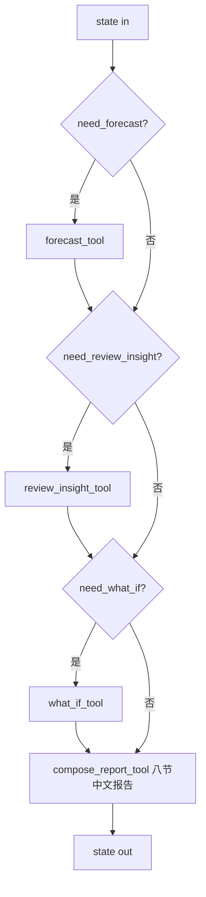

# Decision Intelligence Agent（决策智能层）

面向 **Agentic BI** 4-Agent 方案的末端节点：在 `Orchestrator → Data Analysis → Visualization → Decision Intelligence` 流程的最后一站，把上游的统计结果、图表说明，以及（可选的）销售预测、评论洞察、What-if 模拟整合为面向业务人员的中文运营建议。

它**不**主要负责常规 SQL 查询，也**不**主要负责绘图，而是承担：

| 职责 | 说明 |
|------|------|
| 数据结果解释器 | 把 `sql_results` / `analysis_summary` 翻译成业务语言 |
| 业务原因诊断器 | 配送 / 差评 / 品类下降的可能成因分析 |
| 策略建议生成器 | 分短期 / 中期 / 长期的可执行运营建议 |
| 轻量补充工具调用器 | 在需要时调用 forecast / review_insight / what_if |
| 最终回答组织者 | 按八节模板生成结构化中文报告 |

---

## 1. 目录结构

```
agents/decision_agent/
├── __init__.py
├── db.py                       # 复用 sql_agent 环境变量的 PyMySQL 查询封装
├── state.py                    # AgentState TypedDict + sql_results 摘要工具
├── run.py                      # DecisionIntelligenceAgent 主类 + LangGraph node
├── tools/
│   ├── __init__.py
│   ├── forecast.py             # mv_monthly_sales 历史 GMV → 未来 N 周基线预测
│   ├── review_insight.py       # 差评（review_score<=2）葡语关键词主题分类
│   ├── what_if.py              # 下架 Top N 高差评卖家的反事实模拟
│   └── compose_report.py       # LLM 按八节模板生成中文报告
└── readme.md
```

配套提示词：

```
config/decision_agent/
├── system_core.md              # Agent 角色边界与硬约束
└── decision_report.md          # 报告八节模板规则
```

---

## 2. 输入 / 输出 State 字段

Agent 通过 LangGraph `state` 与其他 Agent 通信。`AgentState` 见 `agents/decision_agent/state.py`。

**主要读取**

| 字段 | 来源 | 说明 |
|------|------|------|
| `question` | Orchestrator | 用户原始问题 |
| `intent` | Orchestrator | `descriptive` / `diagnostic` / `predictive` / `what_if` / `prescriptive` |
| `sql_results` | Data Analysis Agent | `[{name, sql, explanation, columns, row_count, csv_path, sample_rows}]` |
| `analysis_summary` | Data Analysis Agent | 自然语言数据摘要 |
| `chart_paths` | Visualization Agent | 图片路径 |
| `chart_descriptions` | Visualization Agent | 图表的业务说明文本 |

**主要写入**

| 字段 | 说明 |
|------|------|
| `forecast_result` | 预测工具产出（按需） |
| `review_insights` | 评论洞察工具产出（按需） |
| `what_if_result` | What-if 工具产出（按需） |
| `decision_report` | 最终中文八节决策报告 |
| `final_answer` | 与 `decision_report` 同值，便于上层直接 `state["final_answer"]` |

---

## 3. 内部执行链路



路由规则（`run.py`）：

- `need_forecast`：`intent == "predictive"` 或问题命中关键词（`预测 / 未来 / 趋势 / 下周 / forecast / predict ...`）
- `need_review_insight`：问题命中关键词（`评论 / 差评 / 评分 / 抱怨 / sentiment ...`）
- `need_what_if`：`intent == "what_if"` 或命中关键词（`如果 / 假如 / 下架 / what-if ...`）

如果 state 中已经有对应字段，本 Agent 不会重复调用工具，避免覆盖上游结果。

---

## 4. 内部工具

### 4.1 `forecast_tool`（`tools/forecast.py`）

- 历史源：`mv_monthly_sales`
- 方法：`moving_average(3) + seasonal_naive(12) baseline`，月度 → 周度按 4.345 等比折算
- 返回 `method / history_grain / horizon / history_tail / forecast_values / assumptions / summary`
- 后续可替换为 ARIMA / Prophet / XGBoost，接口保持不变

### 4.2 `review_insight_tool`（`tools/review_insight.py`）

- 输入：`order_reviews + orders + order_items + products + sellers + customers + product_category_name_translation` JOIN
- 取 `review_score <= 2` 的差评样本
- 葡语关键词主题分类：`delivery_delay / not_received / product_quality / wrong_item / customer_service / price_freight / missing_parts / other`
- 输出主题计数、Top 受影响品类 / 卖家州 / 客户州，方便决策报告引用

### 4.3 `what_if_tool`（`tools/what_if.py`）

- 场景：下架差评率最高的 Top N 卖家（默认 `top_n=20`，`min_reviews=20`）
- 输出 `current_avg_score / simulated_avg_score / estimated_score_improvement / current_negative_rate / simulated_negative_rate / total_reviews / removed_reviews`
- 在 `assumptions` 中显式声明「静态反事实估计」「不考虑用户需求转移」

### 4.4 `compose_report_tool`（`tools/compose_report.py`）

- 系统提示词由 `config/decision_agent/system_core.md + decision_report.md` 拼接
- 输入：`question / intent / analysis_summary / sql_results_brief / chart_descriptions / forecast_result / review_insights / what_if_result`
- 输出：八节中文报告纯文本

---

## 5. 在 LangGraph 中的接入方式

```python
from langgraph.graph import StateGraph, END
from agents.decision_agent.run import decision_intelligence_node
from agents.decision_agent.state import AgentState

workflow = StateGraph(AgentState)
workflow.add_node("orchestrator", orchestrator_node)
workflow.add_node("data_analysis", data_analysis_node)
workflow.add_node("visualization", visualization_node)
workflow.add_node("decision", decision_intelligence_node)

workflow.set_entry_point("orchestrator")
workflow.add_edge("orchestrator", "data_analysis")
workflow.add_edge("data_analysis", "visualization")
workflow.add_edge("visualization", "decision")
workflow.add_edge("decision", END)

app = workflow.compile()
```

也可独立使用：

```python
from agents.decision_agent.run import DecisionIntelligenceAgent

agent = DecisionIntelligenceAgent()
final = agent.run(state, on_tool_end=lambda t, p: print(t))
print(final["final_answer"])
```

`on_tool_end(tool_name, payload)` 可用于在 Web 端实时推送每一步工具完成事件，与 `sql_agent.run.run_sql_pipeline_with_feedback` 保持风格一致。

---

## 6. 环境变量

复用 SQL Agent 的环境变量；本 Agent 不引入新变量：

| 变量 | 用途 |
|------|------|
| `DEEPSEEK_API_KEY` | LLM（`compose_report_tool`） |
| `AGENTIC_BI_DB_HOST/PORT/USER/PASSWORD/NAME` | 内部三个 SQL 工具连接 MySQL |

---

## 7. 报告输出格式（八节）

```
一、结论摘要
二、关键数据发现
三、原因诊断
四、经营风险
五、决策建议
六、优先级排序
七、图表解读
八、下一步可追问问题
```

详细约束见 `config/decision_agent/decision_report.md`。

---

## 8. 演进路线

1. 在不修改 `run.py` 路由的情况下，把 `forecast.py` / `review_insight.py` 各自升级为独立 Agent；
2. `forecast` 后续可接入 Prophet / ARIMA / XGBoost；`review_insight` 可接入葡语情感模型或 BERTopic；
3. `what_if` 可扩展为多场景（下架低活跃品类、调整运费阶梯等），接口保持 `dict[str, Any]`。
