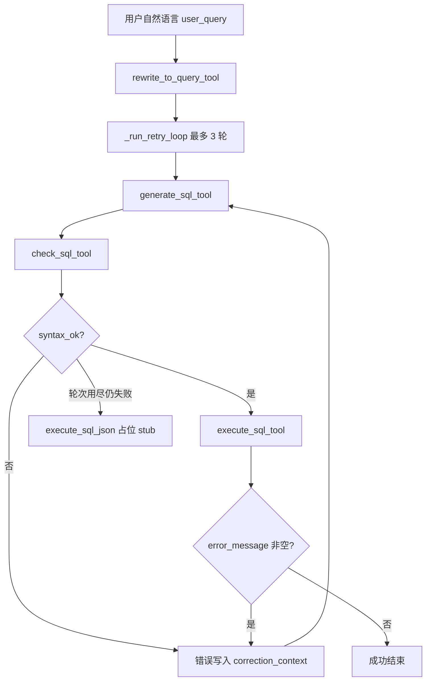

# SQL Agent（数据分析链路）

面向 **Agentic BI** 场景：将业务人员的**自然语言问题**转为 **MySQL 只读查询**，完成本地校验、执行落盘，并向协调器 / 可视化 Agent 输出结构化摘要。对应作业中「数据分析 Agent」里 **NL→SQL、优先预聚合视图** 的子能力。

---

## 1. Agent 作用与输入输出

### 作用

- 加载项目内 `config/data_analysis_agent/` 下的提示词与数据字典，调用 LLM 完成「问题转写 → SQL 生成」。
- 对 SQL 做**本地**格式与安全校验（不连库）。
- 在配置数据库环境变量后**执行 SELECT**，将明细写入 **CSV**（避免把大结果集塞进 LLM 上下文），工具返回路径与列摘要。
- 若校验或执行失败，**自动将错误信息反馈给生成步骤**，最多 **3 次**生成尝试（含首次，最多额外重试 2 次）。

### 对外入口（流水线）

| 函数 | 用途 |
|------|------|
| `run_sql_pipeline_with_feedback(user_query, model=..., on_tool_end=...)` | 返回完整 **dict**；可选 **`on_tool_end(tool_name, json_str)`** 用于 Web 实时推送每一步工具完成事件。 |
| `build_sql_pipeline(model=...)` | 返回 LangChain **`Runnable`**：`invoke(str \| {"user_query": str})` → 与下方相同形状的 **dict**。 |

### 流水线输出 dict（字段说明）

| 字段 | 类型 | 说明 |
|------|------|------|
| `user_query` | `str` | 用户原始问题 |
| `rewrite_json` | `str` | `rewrite_to_query_tool` 输出的 JSON 字符串 |
| `generate_sql_json` | `str` | **最后一轮** `generate_sql_tool` 的 JSON 字符串 |
| `check_sql_json` | `str` | **最后一轮** `check_sql_tool` 的 JSON 字符串 |
| `execute_sql_json` | `str` | **最后一轮**执行结果 JSON；若从未通过校验执行到数据库，则为占位 JSON（见 `run.py` 中 `_EXECUTE_SKIPPED_STUB`） |
| `generate_sql_attempts` | `int` | 实际调用 `generate_sql_tool` 的次数，取值 **1～3** |

---

## 2. 涉及工具及职责

均基于 LangChain **`StructuredTool`**，便于挂到 ReAct / LangGraph 等编排器上。

| 工具名 | 文件 | 是否使用 LLM | 职责 |
|--------|------|----------------|------|
| **rewrite_to_query_tool** | `tools/rewrite_to_query.py` | 是 | 将用户自然语言转为「面向 SQL 生成」的结构化意图（命中视图、候选视图、置信度等）。 |
| **generate_sql_tool** | `tools/generate_sql.py` | 是 | 根据 `rewrite_to_query` 的 JSON 生成 **GenerateSqlOutput**（含 `query_sql`、粒度、表清单、业务说明）；支持 **`correction_context`** 承接校验/执行失败说明以纠错。 |
| **check_sql_tool** | `tools/check_sql.py` | 否 | 解析 **GenerateSqlOutput**，校验字段完整、`SELECT` 格式、反引号小写、只读与安全关键字；**不访问数据库**。 |
| **execute_sql_tool** | `tools/execute_sql.py` | 否 | 解析 JSON、读环境变量连 **MySQL**，执行规范化后的 `query_sql`；结果写入 **`query_results/`**（或 `AGENTIC_BI_SQL_CSV_DIR`），返回摘要 JSON。**不在此重复** `check_sql` 的规则校验（链路上应先执行 `check_sql_tool`）。 |

**LLM 获取**：`llm.py` 中 `get_llm()`（默认 DeepSeek，需 `DEEPSEEK_API_KEY`）。

---

## 3. 内部执行链路（简图）

### 总览



说明：

- **rewrite** 只执行 **1 次**。
- **generate → check →（可选）execute** 在 `_run_retry_loop` 内循环，**generate** 最多 **3** 次。
- `check_sql` 未通过时不会调用 `execute_sql`，直接进入下一轮 `generate_sql`（并附带累积的 `correction_context`）。
- `execute_sql` 失败时同样累积错误并回到 `generate_sql`。

---

## 4. 链路内各工具输入输出（JSON 形态）

以下均为工具 **`invoke` 的参数字典**与返回的 **JSON 字符串**（或等价字段）。字段类型以 Pydantic 模型为准。

### 4.1 `rewrite_to_query_tool`

**输入（StructuredTool 参数）**

```json
{
  "query": "用户自然语言问题全文"
}
```

**输出（JSON 字符串，`RewriteToQueryOutput`）**

```json
{
  "query_for_sql": "面向 SQL 生成的专业表述",
  "hit_pre_agg_view": true,
  "candidate_views": ["mv_monthly_sales", "mv_state_sales"],
  "confidence": 0.95
}
```

---

### 4.2 `generate_sql_tool`

**输入**

```json
{
  "rewrite_json": "<RewriteToQueryOutput 的 JSON 字符串>",
  "correction_context": ""
}
```

`correction_context` 可选；流水线在重试时传入多段 `[check_sql 未通过] …` / `[execute_sql 失败] …` 拼接文本。

**输出（JSON 字符串，`GenerateSqlOutput`）**

```json
{
  "analysis_grain": "year_month + customer_state",
  "used_tables": ["mv_monthly_sales"],
  "query_sql": "SELECT `year_month`, `total_gmv` FROM `mv_monthly_sales` LIMIT 100",
  "result_explanation": "业务口径与视图命中说明"
}
```

约定：`query_sql` 须 **大写 `SELECT`**，标识符 **小写 + 反引号**。

---

### 4.3 `check_sql_tool`

**输入**

```json
{
  "generate_sql_json": "<GenerateSqlOutput 的 JSON 字符串>"
}
```

**输出（JSON 字符串，`CheckSqlOutput`）**

```json
{
  "syntax_ok": true,
  "brief": "通过：JSON 字段完整，query_sql 为约定格式的只读 SELECT。"
}
```

失败时 `syntax_ok` 为 `false`，`brief` 为人类可读原因。

---

### 4.4 `execute_sql_tool`

**输入**

```json
{
  "generate_sql_json": "<GenerateSqlOutput 的 JSON 字符串>"
}
```

**输出（JSON 字符串，`ExecuteSqlOutput`）**

成功且写入 CSV 时核心字段示例：

```json
{
  "ok": true,
  "sql_syntax_ok": true,
  "executed": true,
  "error_stage": null,
  "error_message": null,
  "result_explanation": "来自输入的业务口径说明",
  "query_sql": "规范化后的 SELECT …",
  "row_count_returned": 24,
  "truncated": false,
  "columns": ["year_month", "total_gmv"],
  "column_profiles": [
    {
      "name": "year_month",
      "inferred_type": "string",
      "non_null_count": 24,
      "null_count": 0,
      "sample_values": ["2016-09", "2016-10", "2016-12"]
    }
  ],
  "result_csv_filename": "2026-05-02 22-06-49.csv",
  "result_csv_path": "/绝对路径/…/query_results/2026-05-02 22-06-49.csv",
  "data_summary_zh": "查询返回 … 行…",
  "execution_time_ms": 123.45
}
```

说明：

- **不在 JSON 中返回明细行**；明细以 **CSV** 为准（`utf-8-sig`）。
- `truncated`：是否触发行数上限（默认见环境变量 `AGENTIC_BI_SQL_MAX_ROWS`，默认 5000）。
- 失败时 `ok`/`executed`、`error_stage`、`error_message` 等按阶段填充（含 `env_config`、`csv_write` 等）。

---

## 5. 其他补充

### 5.1 环境变量

| 变量 | 用途 |
|------|------|
| `DEEPSEEK_API_KEY` | LLM（`llm.py`） |
| `AGENTIC_BI_DB_HOST` / `PORT` / `USER` / `PASSWORD` / `NAME` | **必填**，`execute_sql` 连库（无代码内默认密码） |
| `AGENTIC_BI_SQL_MAX_ROWS` | 单次返回最大行数，默认 `5000` |
| `AGENTIC_BI_SQL_CSV_DIR` | CSV 输出目录；未设则为本目录下 **`query_results/`** |

### 5.2 本地运行示例

在 **`agents/sql_agent`** 目录下（保证 `config/data_analysis_agent` 能通过祖先路径解析）：

```bash
export DEEPSEEK_API_KEY=...
export AGENTIC_BI_DB_HOST=... AGENTIC_BI_DB_PORT=3306 AGENTIC_BI_DB_USER=... AGENTIC_BI_DB_PASSWORD=... AGENTIC_BI_DB_NAME=...
python run.py "你的自然语言问题"
```

各工具模块自带 `if __name__ == "__main__"` 可单独演示。

### 5.3 目录结构（与本 Agent 相关）

```
agents/sql_agent/
├── llm.py              # get_llm
├── run.py              # 流水线入口
├── readme.md
├── query_results/      # 默认 CSV 输出（宜加入 .gitignore）
├── tools/
│   ├── rewrite_to_query.py
│   ├── generate_sql.py
│   ├── check_sql.py
│   └── execute_sql.py
└── test/
    └── eval_rewrite_to_query.py  # 评测等
```

### 5.4 与更大系统的衔接

- **协调器**：可将本流水线视为「数据分析」子图；成功后可读取 `execute_sql_json` 中的 **`result_csv_path`**，交给可视化 / 决策 Agent。
- **实时 UI**：优先使用 **`run_sql_pipeline_with_feedback(..., on_tool_end=...)`**，将 `tool_name` + `json_str` 推送到 SSE/WebSocket。
- **作业要求**：预聚合视图说明见仓库根目录 `assignment.md` 与 `config/data_analysis_agent/schema_dictionary.md`。

---

## 6. 依赖

见仓库根目录 **`requirements.txt`**（`langchain`、`langchain-core`、`langchain-deepseek`、`pydantic`、`python-dotenv`、`PyMySQL` 等）。
