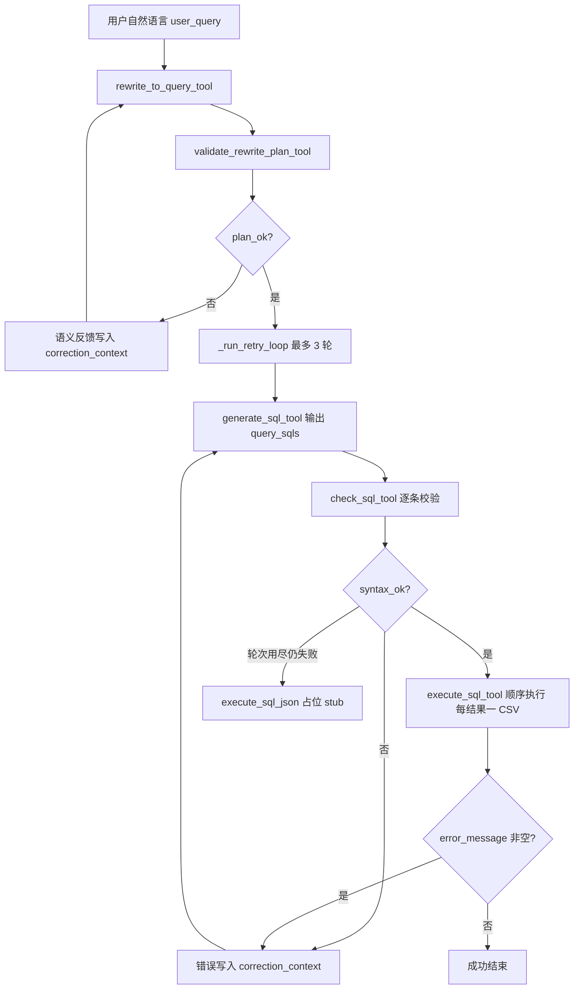

# SQL Agent（数据分析链路）

面向 **Agentic BI** 场景：将业务人员的**自然语言问题**转为 **MySQL 只读查询**，完成本地校验、执行落盘，并向协调器 / 可视化 Agent 输出结构化摘要。对应作业中「数据分析 Agent」里 **NL→SQL、优先预聚合视图** 的子能力。

当前实现支持**一次用户输入中包含多个并列子问题**：转写阶段输出结构化 **`sub_questions`**（含 `metric_key`、`scope`、`inherit_from`），并通过语义校验工具拦截口径漂移；生成阶段输出 **`query_sqls` 数组**（多条 `SELECT`），执行阶段**按序逐条执行**并为每条结果生成**独立 CSV**，摘要落在 **`execute_sql_json.results[]`** 中。

---

## 1. Agent 作用与输入输出

### 作用

- 加载项目内 `config/data_analysis_agent/` 下的提示词与数据字典，调用 LLM 完成「**问题转写（含多意图）** → **SQL 列表生成**」。
- 对转写结果执行结构化语义校验（`validate_rewrite_plan_tool`），由规则文件 `config/data_analysis_agent/rewrite_plan_rules.yaml` 驱动。
- 对 **`query_sqls` 中每一条** SQL 做**本地**格式与安全校验（不连库）。
- 在配置数据库环境变量后**依次执行**各条 `SELECT`，将每条结果写入**独立 CSV**（避免把大结果集塞进 LLM 上下文），工具返回 **`results`**、路径与列摘要。
- 若转写语义校验失败，**自动将校验反馈写入 `correction_context`** 并重试转写，最多 **3 次**。
- 若校验或执行失败，**自动将错误信息写入 `correction_context`** 并回到生成步骤，最多 **3 次**生成尝试（含首次，最多额外重试 2 次）。**任一条 SQL 执行失败**时，整次 `execute_sql` 的顶层 **`ok` 为 `false`**，`error_message` 会汇总失败条目，触发上述重试。

### 多意图约定（与提示词一致）

| 阶段 | 行为 |
|------|------|
| **rewrite** | 识别并列问法，输出结构化 **`sub_questions`**（`id`、`metric_key`、`dimensions`、`time_range`、`aggregation`、`scope`）；`query_for_sql` 为兼容说明字段。规则见 `config/data_analysis_agent/rewrite_to_query_tool.md`。 |
| **validate_rewrite** | 对 `sub_questions` 做规则驱动语义校验；失败时反馈回写到 `rewrite` 的 `correction_context` 并重试。 |
| **generate** | 输出 **`query_sqls`**：优先「一子问题一条 `SELECT`」；单条语句内**禁止分号**；格式见 `config/data_analysis_agent/generate_sql_tool.md`。仅含旧字段 `query_sql` 的 JSON 在解析时会**自动转为**单元素 `query_sqls`。 |
| **check** | 对 `query_sqls` **逐条**校验 `SELECT` 格式、反引号小写、只读安全。 |
| **execute** | 同一连接上**顺序执行**；每条结果一个 CSV；**多条**时文件名为 `YYYY-MM-DD HH-MM-SS_sql1.csv`、`_sql2.csv`…，**单条**时仍为 `YYYY-MM-DD HH-MM-SS.csv`（与改造前命名习惯一致）。 |

### 对外入口（流水线）

| 函数 | 用途 |
|------|------|
| `run_sql_pipeline_with_feedback(user_query, model=..., on_tool_end=...)` | 返回完整 **dict**；可选 **`on_tool_end(tool_name, json_str)`** 用于 Web 实时推送每一步工具完成事件。 |
| `build_sql_pipeline(model=...)` | 返回 LangChain **`Runnable`**：`invoke(str \| {"user_query": str})` → 与下方相同形状的 **dict**。 |

### 流水线输出 dict（字段说明）

| 字段 | 类型 | 说明 |
|------|------|------|
| `user_query` | `str` | 用户原始问题 |
| `rewrite_json` | `str` | `rewrite_to_query_tool` 输出的 JSON 字符串 |
| `validate_rewrite_json` | `str` | `validate_rewrite_plan_tool` 最后一轮输出（含 `plan_ok` 与 `brief`） |
| `rewrite_attempts` | `int` | 实际调用 `rewrite_to_query_tool` 的次数，取值 **1～3** |
| `generate_sql_json` | `str` | **最后一轮** `generate_sql_tool` 的 JSON；最小必需字段为 **`query_sqls`**（`SELECT` 字符串数组），其余说明字段为可选 |
| `check_sql_json` | `str` | **最后一轮** `check_sql_tool` 的 JSON 字符串 |
| `execute_sql_json` | `str` | **最后一轮**执行结果 JSON；含 **`results`**（逐条 SQL 的 CSV 路径与摘要）、顶层 **`ok`** / **`error_message`**；若从未通过校验执行到数据库，则为占位 JSON（见 `run.py` 中 `_EXECUTE_SKIPPED_STUB`） |
| `generate_sql_attempts` | `int` | 实际调用 `generate_sql_tool` 的次数，取值 **1～3** |

---

## 2. 涉及工具及职责

均基于 LangChain **`StructuredTool`**，便于挂到 ReAct / LangGraph 等编排器上。

| 工具名 | 文件 | 是否使用 LLM | 职责 |
|--------|------|----------------|------|
| **rewrite_to_query_tool** | `tools/rewrite_to_query.py` | 是 | 将用户自然语言转为结构化计划（`sub_questions` + `query_for_sql` 兼容字段 + 视图命中）。 |
| **validate_rewrite_plan_tool** | `tools/validate_rewrite_plan.py` | 否 | 按 `rewrite_plan_rules.yaml` 执行语义校验，失败时提供 `brief` 供转写重试纠偏。 |
| **generate_sql_tool** | `tools/generate_sql.py` | 是 | 根据 `rewrite_to_query` 的 JSON 生成 **GenerateSqlOutput**（最小必需字段为 **`query_sqls`**；其余粒度/表清单/业务说明字段可选）；支持 **`correction_context`** 承接校验/执行失败说明以纠错。 |
| **check_sql_tool** | `tools/check_sql.py` | 否 | 解析 **GenerateSqlOutput**，对 **`query_sqls` 中每条** `SELECT` 校验格式、反引号小写、只读与安全关键字；**不访问数据库**。 |
| **execute_sql_tool** | `tools/execute_sql.py` | 否 | 解析 JSON、读环境变量连 **MySQL**，**依次**执行 `query_sqls`；每条结果写入**独立 CSV**（多条时为 `时间戳_sql1.csv`…），返回 **`results`** 与聚合摘要。**不在此重复** `check_sql` 的规则校验（链路上应先执行 `check_sql_tool`）。 |

共享 SQL 规则模块：`tools/sql_format_rules.py`（`normalize_sql`、`query_sql_format_ok`、`read_only_select_ok`）。

**LLM 获取**：`llm.py` 中 `get_llm()`（默认 DeepSeek，需 `DEEPSEEK_API_KEY`）。

---

## 3. 内部执行链路（简图）

### 总览



说明：

- **流程图**：`execute_sql` 在**任一条** SQL 失败时仍可能返回部分 **`results`**，但顶层 **`ok` 为 false** 且 **`error_message` 非空**，`run.py` 据此进入重试。
- **rewrite** 最多执行 **3 次**：若 `validate_rewrite_plan` 未通过，会将 `brief` 累积为 `correction_context` 重试。工具内结构化重试次数由 `run.py` 的 `TOOL_MODEL_RETRIES` 统一控制（当前为 1）。
- **generate → check → execute** 在 `_run_retry_loop` 内循环，**generate** 最多 **3** 次；每轮输出 **`GenerateSqlOutput`**，其中 **`query_sqls`** 为必需字段。
- `check_sql` 未通过时不会调用 `execute_sql`，直接进入下一轮 `generate_sql`（并附带累积的 `correction_context`）。
- `execute_sql` 在**任一条** SQL 报错或写 CSV 失败时，顶层 **`ok` 为 `false`** 且 **`error_message` 非空**，流水线将错误写入 `correction_context` 并回到 `generate_sql`；全部成功时 **`ok` 为 `true`** 且 **`error_message` 为空或 null**。

---

## 4. 链路内各工具输入输出（JSON 形态）

以下均为工具 **`invoke` 的参数字典**与返回的 **JSON 字符串**（或等价字段）。字段类型以 Pydantic 模型为准。

### 4.1 `rewrite_to_query_tool`

**输入（StructuredTool 参数）**

```json
{
  "query": "用户自然语言问题全文",
  "correction_context": ""
}
```

**输出（JSON 字符串，`RewriteToQueryOutput`）**

```json
{
  "query_for_sql": "兼容字段：面向 SQL 生成的自然语言说明",
  "sub_questions": [
    {
      "id": "q1",
      "question_zh": "2017年哪个州销售额最高？",
      "metric_key": "state_gmv_rank",
      "dimensions": ["customer_state"],
      "time_range": "2017",
      "aggregation": "top1",
      "scope": {
        "kind": "platform",
        "inherit_from": null,
        "explicit_filter": ""
      }
    },
    {
      "id": "q2",
      "question_zh": "该州交付准时率是多少？",
      "metric_key": "on_time_rate",
      "dimensions": [],
      "time_range": "2017",
      "aggregation": "overall_rate",
      "scope": {
        "kind": "inherit_previous",
        "inherit_from": "q1",
        "explicit_filter": ""
      }
    }
  ],
  "hit_pre_agg_view": true,
  "candidate_views": ["mv_monthly_sales", "mv_state_sales"],
  "confidence": 0.95
}
```

约定：

- `sub_questions` 是后续 `generate_sql` 的主依据，`query_for_sql` 为兼容字段。
- `correction_context` 可选；当语义校验失败时，流水线会自动传入失败原因以触发重写。
- 输出会自动省略默认值与空字段（`exclude_defaults/exclude_none`），减少 JSON 噪音。

---

### 4.2 `validate_rewrite_plan_tool`

**输入**

```json
{
  "user_query": "用户原始问题",
  "rewrite_json": "<RewriteToQueryOutput 的 JSON 字符串>"
}
```

**输出**

```json
{
  "plan_ok": true,
  "brief": "通过：sub_questions 结构完整，规则引擎校验通过。"
}
```

`plan_ok=false` 时，`brief` 会被写入 `rewrite_to_query_tool.correction_context`，并触发重写重试（最多 3 次）。

---

### 4.3 `generate_sql_tool`

**输入**

```json
{
  "rewrite_json": "<RewriteToQueryOutput 的 JSON 字符串>",
  "correction_context": ""
}
```

`correction_context` 可选；流水线在重试时会传入多段反馈拼接文本，来源包括 `[validate_rewrite_plan 未通过] …`、`[check_sql 未通过] …`、`[execute_sql 失败] …`。

**输出（JSON 字符串，`GenerateSqlOutput`）**

```json
{
  "query_sqls": [
    "SELECT `year_month`, `total_gmv` FROM `mv_monthly_sales` LIMIT 100",
    "SELECT `year_month`, `customer_state`, `total_gmv` FROM `mv_state_sales` LIMIT 500"
  ]
}
```

约定：

- 每条 `query_sqls[i]` 须 **大写 `SELECT`**，标识符 **小写 + 反引号**，**单条内不得含分号**；多语句依赖**数组中的多条字符串**，不要用分号拼接。
- `analysis_grain`、`used_tables`、`result_explanation` 为可选增强字段，不影响链路执行。
- 旧版仅含 `query_sql` 的 JSON 在解析时会**自动转为**单元素 `query_sqls`（`generate_sql.py` 中 `model_validator`）。

---

### 4.4 `check_sql_tool`

**输入**

```json
{
  "generate_sql_json": "<GenerateSqlOutput 的 JSON 字符串>"
}
```

**输出（JSON 字符串，`CheckSqlOutput`）**

```json
{
  "syntax_ok": true,
  "brief": "通过：JSON 字段完整，共 N 条只读 SELECT，格式与关键字安全校验均通过。"
}
```

失败时 `syntax_ok` 为 `false`，`brief` 为人类可读原因，并标明 **`query_sqls[k]`** 中第几条未通过（若适用）。

---

### 4.5 `execute_sql_tool`

**输入**

```json
{
  "generate_sql_json": "<GenerateSqlOutput 的 JSON 字符串>"
}
```

**输出（JSON 字符串，`ExecuteSqlOutput`）**

核心字段：

| 字段 | 含义 |
|------|------|
| `ok` | **全部** SQL 成功执行且 CSV 写出为 `true`；任一条失败为 `false`。 |
| `results` | 与 `query_sqls` **顺序一致**；每条含 `index`、`ok`、`result_csv_path`、行数/截断/摘要、单条 `execution_time_ms` 与错误信息等。 |
| `row_count_returned` / `execution_time_ms` | 各条对应字段**求和**。 |
| 顶层输出原则 | 顶层仅保留聚合状态与聚合统计；文件路径与列信息统一放在 `results[]`，不再重复单条兼容字段。 |

成功且写入 CSV 的示例（**单条** `query_sqls`）：

```json
{
  "ok": true,
  "executed": true,
  "results": [
    {
      "index": 0,
      "ok": true,
      "row_count_returned": 24,
      "result_csv_path": "/…/query_results/2026-05-02 22-06-49.csv",
      "data_summary_zh": "…",
      "execution_time_ms": 50.0
    }
  ],
  "row_count_returned": 24,
  "data_summary_zh": "共执行 1 条 SQL。 …",
  "execution_time_ms": 50.0
}
```

**多条** `query_sqls` 时：`results` 中含多项，每项各有 `result_csv_path`（文件名形如 `时间戳_sql1.csv`）。

说明：

- **不在 JSON 中返回明细行**；明细以 **CSV** 为准（`utf-8-sig`）。**每条 SQL 对应一个 CSV**（多条：`时间戳_sql1.csv`、`时间戳_sql2.csv`…；仅一条：`时间戳.csv`）。
- 顶层 **`truncated`**：任一条结果触发行数上限则为 `true`（默认见 `AGENTIC_BI_SQL_MAX_ROWS`，默认 5000）。
- **解析失败 / 环境变量缺失**：通过 `executed`、`error_stage`、`error_message` 体现；**单条 SQL 在库内失败**时，该条在 `results` 中 `ok: false` 并带 `error_message`，同时顶层 `ok: false` 且 `error_message` 汇总多条失败原因（含 `[SQL#2] …` 形式）。

---

## 5. 其他补充

### 5.1 环境变量

| 变量 | 用途 |
|------|------|
| `DEEPSEEK_API_KEY` | LLM（`llm.py`） |
| `AGENTIC_BI_DB_HOST` / `PORT` / `USER` / `PASSWORD` / `NAME` | **必填**，`execute_sql` 连库（无代码内默认密码） |
| `AGENTIC_BI_SQL_MAX_ROWS` | 单次返回最大行数，默认 `5000` |
| `AGENTIC_BI_SQL_CSV_DIR` | CSV 输出目录；未设则为本目录下 **`query_results/`** |

### 5.2 本地运行示例

在 **`agents/sql_agent`** 目录下（保证 `config/data_analysis_agent` 能通过祖先路径解析）：

```bash
export DEEPSEEK_API_KEY=...
export AGENTIC_BI_DB_HOST=... AGENTIC_BI_DB_PORT=3306 AGENTIC_BI_DB_USER=... AGENTIC_BI_DB_PASSWORD=... AGENTIC_BI_DB_NAME=...
python run.py "你的自然语言问题"
```

不传参数时，`run.py` 会依次跑内置 **`TEST_QUESTIONS`**（多意图与单问混合，便于回归）。

各工具模块自带 `if __name__ == "__main__"` 可单独演示。

### 5.3 目录结构（与本 Agent 相关）

```
agents/sql_agent/
├── llm.py              # get_llm
├── run.py              # 流水线入口
├── readme.md
├── query_results/      # 默认 CSV 输出（宜加入 .gitignore）
├── tools/
│   ├── rewrite_to_query.py
│   ├── validate_rewrite_plan.py
│   ├── sql_format_rules.py
│   ├── generate_sql.py
│   ├── check_sql.py
│   └── execute_sql.py
└── test/
    └── eval_rewrite_to_query.py  # 评测等
```

规则配置：

```
config/data_analysis_agent/
├── rewrite_plan_rules.yaml  # validate_rewrite_plan_tool 规则源
└── ...
```

### 5.4 与更大系统的衔接

- **协调器 / 可视化**：解析 **`execute_sql_json`** 时，应优先根据 **`query_sqls` 长度**分支：
  - 统一遍历 **`results`**，按 **`index`** 与业务子问题对齐，将多个 CSV 分别交给图表组件（例如一图一文件）或合并摘要后再交给决策 Agent。
- **实时 UI**：优先使用 **`run_sql_pipeline_with_feedback(..., on_tool_end=...)`**，将 `tool_name` + `json_str` 推送到 SSE/WebSocket；多 SQL 时可在前端对 `execute_sql_json` 中的 **`results`** 做分块展示。
- **作业要求**：预聚合视图说明见仓库根目录 `assignment.md` 与 `config/data_analysis_agent/schema_dictionary.md`。

---

## 6. 依赖

见仓库根目录 **`requirements.txt`**（`langchain`、`langchain-core`、`langchain-deepseek`、`pydantic`、`python-dotenv`、`PyMySQL` 等）。
