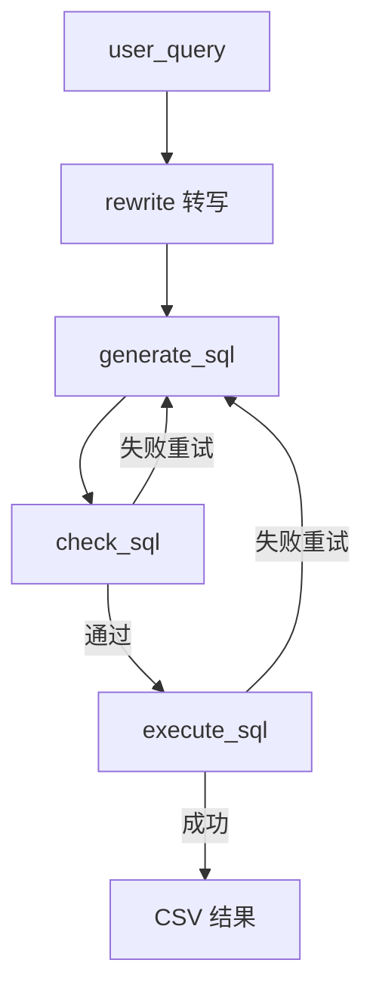

# SQL Agent（数据分析链路）

将自然语言问题转为 **MySQL 只读查询**：优先命中预聚合视图，否则回退原始表 JOIN；支持单问与多子问题；结果写入 CSV，供协调器 / 可视化 Agent 消费。

---

## 快速运行

```bash
export DEEPSEEK_API_KEY=...
export AGENTIC_BI_DB_HOST=... AGENTIC_BI_DB_PORT=3306
export AGENTIC_BI_DB_USER=... AGENTIC_BI_DB_PASSWORD=... AGENTIC_BI_DB_NAME=...

python -m agents.sql_agent.run "2017年哪个州的销售额最高？"
python -m agents.sql_agent.run   # 无参数时跑内置 TEST_QUESTIONS
```

经协调器调用（推荐）：

```bash
python -m agents.coordinator_agent.run --query "2017年哪个州的销售额最高？"
```

---

## 执行链路


```mermaid
flowchart TD
  A["user_query"] --> B["rewrite 转写"]
  B --> D["generate_sql"]
  D --> E["check_sql"]
  E -->|失败重试| D
  E -->|通过| F["execute_sql"]
  F -->|失败重试| D
  F -->|成功| G["CSV 结果"]
```

> rewrite 与 generate 各最多重试 3 次；失败时错误写入 `correction_context`。rewrite 结构一致性由 Pydantic schema 保证。

| 阶段 | 说明 |
|------|------|
| **rewrite** | 拆 `sub_questions`，标注 `hit_pre_agg_view` / `candidate_views` |
| **generate** | 输出 `query_sqls[]`，一子问题一条 `SELECT`，单条内禁止分号 |
| **check** | 格式与只读校验（不连库，不是语法解析） |
| **execute** | 执行前再做只读闸门；顺序执行，每条 SQL 一个 CSV；明细不进 LLM 上下文 |

失败时错误写入 `correction_context` 自动重试。任一条 SQL 执行失败则顶层 `ok=false`。

---

## 对外入口

| 函数 | 用途 |
|------|------|
| `run_sql_pipeline_with_feedback(...)` | 完整流水线 dict；支持 `on_tool_end` 回调 |

### 输出 dict 关键字段

| 字段 | 说明 |
|------|------|
| `rewrite_json` | 转写结果（含 `sub_questions`、`hit_pre_agg_view`） |
| `generate_sql_json` | 含 `query_sqls` 数组 |
| `execute_sql_json` | 含 `ok`、`results[]`（`result_csv_path`、摘要、耗时） |
| `*_attempts` | 各阶段实际重试次数（1～3） |

下游应遍历 `execute_sql_json.results[]`，按 `index` 与子问题 / 图表对齐。

---

## 工具一览

| 工具 | LLM | 职责 |
|------|-----|------|
| `rewrite_to_query_tool` | 是 | NL → 结构化计划 + 视图命中 |
| `generate_sql_tool` | 是 | 计划 → `query_sqls` |
| `check_sql_tool` | 否 | 格式与只读校验（不连库） |
| `execute_sql_tool` | 否 | 执行前只读闸门，连库执行，写 CSV |

共享规则：`tools/sql_format_rules.py`。LLM：`agents.common.llm.invoke_structured`（DeepSeek，关思考）。

---

## 环境变量

| 变量 | 用途 |
|------|------|
| `DEEPSEEK_API_KEY` | LLM |
| `AGENTIC_BI_DB_*` | MySQL 连接（execute 必填） |
| `AGENTIC_BI_SQL_MAX_ROWS` | 行数上限，默认 5000 |
| `AGENTIC_BI_SQL_CSV_DIR` | CSV 目录，默认 `query_results/` |

---

## 目录与配置

```
agents/sql_agent/
├── __init__.py
├── pipeline.py         # 重试循环与对外入口
├── run.py              # CLI + re-export：python -m agents.sql_agent.run
├── tools/              # 四个 StructuredTool
├── tests/              # 纯本地单测（不连库、不调 LLM）
└── test/eval_rewrite_to_query.py

config/sql_agent/
├── system_core.md              # 视图优先策略
├── schema_dictionary.md        # 表 + 视图字典 + 通用指标语义
├── rewrite_to_query_tool.md
└── generate_sql_tool.md
```

预聚合视图说明见根目录 `assignment.md`、`config/view_metadata.json`（视图文档，运行时 Prompt 只注入 `schema_dictionary.md`）。

---

## 依赖

见仓库根目录 `requirements.txt`（`langchain==1.4.0`、`langgraph==1.2.11`、`pydantic`、`PyMySQL` 等）。
