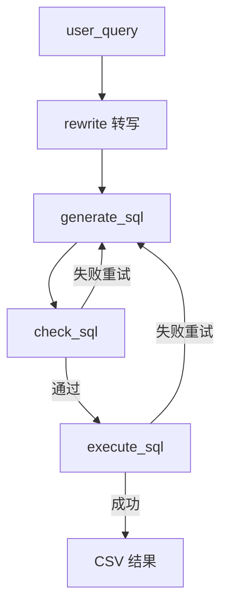

# SQL Agent（数据分析链路）

将自然语言问题转为 **MySQL 只读查询**：优先命中预聚合视图，否则回退原始表 JOIN；支持单问与多子问题；结果写入 CSV，供协调器 / 可视化 Agent 消费。

---

## 快速运行

```bash
export DEEPSEEK_API_KEY=...   # 或 DASHSCOPE_API_KEY=... 且 AGENTIC_BI_LLM_PROVIDER=qwen
export AGENTIC_BI_DB_HOST=... AGENTIC_BI_DB_PORT=3306
export AGENTIC_BI_DB_USER=... AGENTIC_BI_DB_PASSWORD=... AGENTIC_BI_DB_NAME=...

python -m agents.sql_agent.run "2017年哪个州的销售额最高？"
python -m agents.sql_agent.run   # 无参数时跑内置 TEST_QUESTIONS
```

经协调器调用（推荐）：

```bash
python -m agents.coordinator_agent.run --query "2017年哪个州的销售额最高？"
```

---

## 执行链路


```mermaid
flowchart TD
  A["user_query"] --> B["rewrite 转写"]
  B --> D["generate_sql"]
  D --> E["check_sql"]
  E -->|失败重试| D
  E -->|通过| F["execute_sql"]
  F -->|失败重试| D
  F -->|成功| G["CSV 结果"]
```

> rewrite 与 generate 各最多重试 3 次；失败时错误写入 `correction_context`。rewrite 结构一致性由 Pydantic schema 保证。

| 阶段 | 说明 |
|------|------|
| **rewrite** | 拆 `sub_questions`，标注 `hit_pre_agg_view` / `candidate_views` |
| **generate** | 输出 `query_sqls[]`，一子问题一条 `SELECT`，标识符小写裸写（禁止反引号），单条内禁止分号 |
| **check** | 格式与只读校验（不连库；反引号即格式失败） |
| **execute** | 执行前再做只读闸门；顺序执行，每条 SQL 一个 CSV（UTF-8 无 BOM；失败也占 sqlN）；明细不进 LLM 上下文；标量子问题若不是 1 行则带回生成重试 |

失败时错误写入 `correction_context` 自动重试（含标量行数）。任一条 SQL 执行失败则顶层 `ok=false`。

---

## 对外入口

| 函数 | 用途 |
|------|------|
| `run_sql_pipeline_with_feedback(...)` | 完整流水线 dict；支持 `on_tool_end` 回调 |

### 输出 dict 关键字段

| 字段 | 说明 |
|------|------|
| `rewrite_json` | 转写结果（含 `sub_questions`、`hit_pre_agg_view`） |
| `generate_sql_json` | 含 `query_sqls` 数组 |
| `execute_sql_json` | 含 `ok`、`results[]`（`result_csv_path`、摘要、耗时） |
| `*_attempts` | 各阶段实际重试次数（1～3） |

下游应遍历 `execute_sql_json.results[]`，按 `index` 与子问题 / 图表对齐。

---

## 工具一览

| 工具 | LLM | 职责 |
|------|-----|------|
| `rewrite_to_query_tool` | 是 | NL → 结构化计划 + 视图命中 |
| `generate_sql_tool` | 是 | 计划 → `query_sqls` |
| `check_sql_tool` | 否 | 格式与只读校验（不连库） |
| `execute_sql_tool` | 否 | 执行前只读闸门，连库执行，写 CSV |

共享规则：`tools/sql_format_rules.py`、`tools/result_shape.py`。LLM：`agents.common.llm.invoke_structured`（当前提供商，关思考）。

---

## 环境变量

| 变量 | 用途 |
|------|------|
| `DEEPSEEK_API_KEY` / `DASHSCOPE_API_KEY` | 当前 LLM 提供商对应的 Key |
| `AGENTIC_BI_LLM_PROVIDER` | 可选，`deepseek`（默认）或 `qwen` |
| `AGENTIC_BI_DB_*` | MySQL 连接（execute 必填） |
| `AGENTIC_BI_SQL_MAX_ROWS` | 行数上限，默认 5000 |
| `AGENTIC_BI_SQL_CSV_DIR` | CSV 目录，默认 `query_results/` |

---

## 评测（Execution Accuracy）

对外准确率是 **EX**：金标 SQL 与流水线最终 `query_sqls` 在同一库执行后比较结果集，不是 SQL 文本匹配，也不是「能执行 / 点对了视图」。

判过规则：每条 intent 二元 PASS/FAIL；一题全部 intent 通过才算题 PASS。`question_ex` = 题 PASS 数 / 非 OOS 题数。复合问漏一个子查询则题 FAIL。OOS（词云、预测、热力）不进分母。

能力阶梯金标（各 8 题，不含 OOS）与作业对照套件分开：

| suite | 文件 | 测什么 |
| --- | --- | --- |
| `smoke` | `gold/smoke.json` | 冒烟：链路能否出可执行 SQL、单表/单视图口径 |
| `general` | `gold/general.json` | 通用：视图命中、过滤、单表计算、简单多表 JOIN |
| `complex` | `gold/complex.json` | 复杂：多表口径、继承前序对象、比率/加权 |
| `extreme` | `gold/extreme.json` | 极端但有业务含义：跨年对比、交叉过滤、复购/运费结构 |
| `capability` | 以上四个 | 32 题一起跑 |
| `assignment` | `phase1.json` + `phase2.json` | 作业参考问 + 字面量/OOS |

比较器单测进 CI（不连库、不调 LLM）：

```bash
pytest agents/sql_agent/tests/test_ex_compare.py agents/sql_agent/tests/test_eval_ex_helpers.py -q
```

实库评测（需 `.env` 与当前提供商的 API Key）：

```bash
# 只检查金标 SQL 能否执行、行数形态是否符合 scalar / topk
python agents/sql_agent/test/eval_ex.py --suite capability --validate-gold
python agents/sql_agent/test/eval_ex.py --suite assignment --validate-gold

# 按能力档位跑 EX（需 LLM）
python agents/sql_agent/test/eval_ex.py --suite smoke
python agents/sql_agent/test/eval_ex.py --suite general
python agents/sql_agent/test/eval_ex.py --suite complex
python agents/sql_agent/test/eval_ex.py --suite extreme

# 作业对照 1 期 / 1+2 期稳定性
python agents/sql_agent/test/eval_ex.py --suite phase1
python agents/sql_agent/test/eval_ex.py --suite assignment --repeat 3

# rewrite 消融（主指标同样是 EX，不含 OOS；默认识作业对照）
python agents/sql_agent/test/eval_rewrite_ablation.py
python agents/sql_agent/test/eval_rewrite_ablation.py --suite smoke
```

结果写在 `agents/sql_agent/test/eval_outputs/`（gitignore）。`eval_rewrite_to_query.py` 只诊断 rewrite 视图点名，**不能**当成 Text-to-SQL 准确率。

---

## 目录与配置

```
agents/sql_agent/
├── __init__.py
├── pipeline.py         # 重试循环与对外入口
├── run.py              # CLI + re-export：python -m agents.sql_agent.run
├── tools/              # 四个 StructuredTool
├── tests/              # 纯本地单测（不连库、不调 LLM）
└── test/               # 实库 / LLM 评测脚本与金标
    ├── gold/smoke.json
    ├── gold/general.json
    ├── gold/complex.json
    ├── gold/extreme.json
    ├── gold/phase1.json
    ├── gold/phase2.json
    ├── eval_ex.py
    ├── eval_rewrite_to_query.py
    └── eval_rewrite_ablation.py

config/sql_agent/
├── system_core.md              # 视图优先策略
├── schema_dictionary.md        # 表 + 视图字典 + 通用指标语义
├── rewrite_to_query_tool.md
└── generate_sql_tool.md
```

预聚合视图说明见根目录 `assignment.md`、`config/view_metadata.json`（视图文档，运行时 Prompt 只注入 `schema_dictionary.md`）。

---

## 依赖

见仓库根目录 `requirements.txt`（`langchain==1.4.0`、`langgraph==1.2.11`、`pydantic`、`PyMySQL` 等）。
