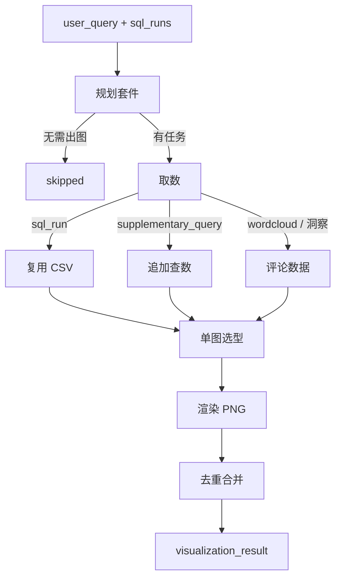

# 可视化 Agent（Visualize）

面向 **Agentic BI**：查数完成后，按用户问题规划要不要图、几张、数据从哪来，再用 matplotlib / seaborn / wordcloud 渲染 PNG。产品路径只经协调器。

---

## 1. 依赖与环境

- 规划图表时需 **`DEEPSEEK_API_KEY`**。
- 可选：`AGENTIC_BI_VIZ_DIR` — PNG 输出目录；默认 `agents/viz_agent/chart_output/`。
- 可选：`AGENTIC_BI_VIZ_FONT` — 中文字体（`.ttf` / `.ttc`）。未设置时按系统探测：Windows 微软雅黑、macOS 冬青黑体/黑体/宋体/苹方、Linux Noto CJK。仍显示方框时再设该变量。

---

## 2. 对外入口

协调器 `visualization_node` 调用：

```python
from agents.viz_agent.intelligent_viz import run_intelligent_visualization
```

| 参数 | 说明 |
|------|------|
| `user_query` | 用户问题 |
| `intent` | 协调器意图，默认 `descriptive` |
| `sql_runs` | 已完成的查数结果列表 |
| `review_insights` | 可选；评论洞察（词云等） |
| `use_llm` | `False` 时规划与单图选型走启发式 |

返回 `visualization_result`：`skipped`、`summary_text`、`charts[]`、`viz_plan`；预测图可能带 `forecast_result`。

经协调器（推荐）：

```bash
python -m agents.coordinator_agent.run --query "2017 年各州订单量 TOP10"
```

单图渲染（`run_visualization_agent` / `plan_with_llm` / `heuristic_plan`）是套件内部实现，测试可直接 import，不是对外 API。出图包不依赖协调器；补查仍走查数流水线。

---

## 3. 执行链路



> 规划阶段会给每条已成功的 `sql_run` 补至少 1 张图，并丢掉 NLP 数据为空的洞察任务。纯描述性单指标（如「2017 GMV 是多少」）通常 **0 张图**。单图选型失败回退启发式。

| 阶段 | 说明 |
|------|------|
| **规划套件** | 读问题、intent、各 `sql_run` 的列与摘要 → 要不要图、几张、数据从哪来（`plan_suite.md`） |
| **取数** | 优先复用已有 SQL CSV；不够时向数据分析 Agent 发 `supplementary_query`；评论类走词云 / 洞察表 |
| **单图选型** | LLM 按 `plan_chart.md` 选类型与列映射；`use_llm=False` 或失败时走启发式 |
| **渲染** | matplotlib / seaborn / wordcloud 出 PNG；折线可叠预测；`rationale` 不画入图 |
| **去重合并** | 仅剔除类型 + 内容完全相同的图，汇总为 `charts[]` |

支持的 `chart_type`：`line`、`bar`、`heatmap`、`scatter`、`geo_scatter`、`wordcloud`。约束见 `config/visualization_agent/plan_chart.md`。

---

## 4. 单图调试 CLI

隔离渲染层，不经过协调器：

```bash
python agents/viz_agent/run.py --csv path/to/result.csv --query "各州销售额对比" --no-llm
```

---

## 5. 改进方向（可选）

- 地理 choropleth 底图需 GeoPandas/shapefile；当前为按需州中心点气泡。
