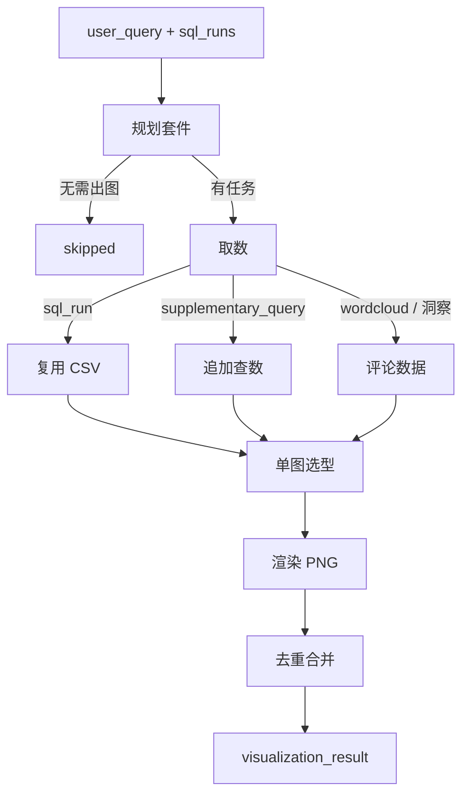

# 可视化 Agent（Visualize）

面向 **Agentic BI**：查数完成后，按用户问题规划要不要图、几张、数据从哪来，再用 matplotlib / seaborn / wordcloud 渲染 PNG。产品路径只经协调器。

## 目录结构

```
agents/viz_agent/
├── __init__.py
├── run.py                 # 单图调试 CLI + 单图选型
├── intelligent_viz.py     # 产品路径入口（套件 → 取数 → 选型 → 渲染）
├── schema.py              # VizPlan / 单图输出契约
├── plan/                  # 套件规划、折线列规范化
├── data/                  # 查数 CSV 选择、评论洞察表、GMV 预测
├── render/                # PNG 渲染与输出目录
└── tests/
```

配套提示词：`config/visualization_agent/`。默认 PNG 目录仍是包根 `chart_output/`。

---

## 1. 依赖与环境

- 规划图表时需 **`DEEPSEEK_API_KEY`**。
- 可选：`AGENTIC_BI_VIZ_DIR` — PNG 输出目录；默认 `agents/viz_agent/chart_output/`。
- 可选：`AGENTIC_BI_VIZ_FONT` — 中文字体（`.ttf` / `.ttc`）。未设置时按系统探测：Windows 微软雅黑、macOS 冬青黑体/黑体/宋体/苹方、Linux Noto CJK。仍显示方框时再设该变量。

---

## 2. 对外入口

协调器 `visualization_node` 调用：

```python
from agents.viz_agent.intelligent_viz import run_intelligent_visualization
```

### 2.1 输入（函数参数，不是单一 JSON）

| 字段 | 类型 | 含义 |
|------|------|------|
| `user_query` | `str` | 用户原问，用于判断要不要图、补规划标题 |
| `intent` | `str` | 协调器意图，默认 `descriptive`；`predictive` / `diagnostic` 会强制或加码出图 |
| `sql_runs` | `list[dict]` | 已完成的查数结果（见下表）；空则协调器侧直接跳过 |
| `review_insights` | `dict \| None` | 评论洞察（词云 / 主题分布等）；协调器传入 `review_insights` 或 `nlp_result` |
| `on_tool_end` | 可选 | 每张图渲染完回调 `(name, json_str)`，供 SSE / 调试 |

规划与单图选型走 `agents.common.llm.invoke_structured`（默认 DeepSeek）。`model` 仅测试注入；产品路径不要再传 `use_llm`。LLM 失败回退启发式，不是可配置开关。

`sql_runs[]` 一条（协调器写入）：

| 字段 | 类型 | 含义 |
|------|------|------|
| `question` | `str` | 该条子问题中文 |
| `index` | `int` | 在 `sub_questions` 中的下标 |
| `execute_sql_json` | `str` | 查数执行结果的 **JSON 字符串**（出图主要读这个） |
| `analysis_result` | `dict` | 业务摘要、命中视图等，规划时作补充 |
| `sql_pipeline` | `dict` | 完整查数流水线（转写 / 生成 / 执行），出图一般不直接用 |

`execute_sql_json` 解析后（出图用到的子集）：

| 字段 | 含义 |
|------|------|
| `ok` | 该次查数是否成功 |
| `results[]` | 多 SQL 时每条一个结果；`ok`、`result_csv_path`、`data_summary_zh`、`row_count_returned` |
| `result_csv_path` | 旧版单 CSV 顶层路径（无 `results[]` 时的兜底） |
| `column_profiles[]` | 列画像：`name`、`inferred_type`、`non_null_count`、`sample_values`；可能为空，规划会从摘要或 CSV 表头补列名 |
| `data_summary_zh` | 中文数据摘要（含「共 N 列：…」时用来解析列名） |

`review_insights` 用到的子集：

| 字段 | 含义 |
|------|------|
| `summary` | 评论洞察文字摘要 |
| `topic_distribution` | `{主题键: 条数}`，差评原因柱状图 |
| `complaints_by_category` | 品类 × 主题交叉，热力图 |
| `top_categories` | 差评品类列表（规划上下文） |
| `wordcloud` | `{positive: {词: 权重}, negative: {词: 权重}}`；缺省时词云任务会自行拉数 |

### 2.2 输出 `visualization_result`

```json
{
  "skipped": false,
  "summary_text": "共生成 2 张图表，覆盖 2 种类型（bar, line）。",
  "charts": [],
  "chart_type_counts": {"bar": 1, "line": 1},
  "viz_plan": {},
  "forecast_result": null
}
```

| 字段 | 类型 | 含义 |
|------|------|------|
| `skipped` | `bool` | `true`：无需出图或没有可制图任务（如纯「2017 GMV 是多少」单值） |
| `summary_text` | `str` | 给人看的一句话；跳过时写原因，成功时写张数与类型 |
| `charts[]` | `list` | 去重后的图清单（成功、失败都可能在，失败带 `error_message`） |
| `chart_type_counts` | `dict` | 成功图按 `chart_type` 计数；跳过路径可能没有此字段 |
| `viz_plan` | `dict` | 套件规划全文（见 §3.1）；协调器「尚无 SQL」跳过时可能缺省 |
| `forecast_result` | `dict` | 仅当折线叠了 6 周 GMV 外推时出现，供决策 / 汇总复用 |

`charts[]` 一条：

| 字段 | 含义 |
|------|------|
| `ok` | 该张 PNG 是否渲染成功 |
| `chart_type` | `line` / `bar` / `heatmap` / `scatter` / `geo_scatter` / `wordcloud` |
| `title` | 图标题（来自单图计划） |
| `question` | 驱动这张图的问句（子问题或补充查数原文） |
| `image_path` | PNG 绝对路径；失败可空 |
| `csv_path` | 制图用的 CSV；词云 / 洞察图可空 |
| `error_message` | 失败原因 |
| `chart_id` / `preset` | 预留，当前产品路径多为空 |

`forecast_result`（有则）：`ok`、`method`、`horizon` / `horizon_weeks`、`summary_text`、`forecast_values` / `values`、`periods`、`lower` / `upper`、`trend_direction`、`weekly_forecast`、`risk_flags` 等。

经协调器（推荐）：

```bash
python -m agents.coordinator_agent.run --query "2017 年各州订单量 TOP10"
```

单图渲染（`run_visualization_agent` / `plan_with_llm` / `heuristic_plan`）是套件内部实现，测试可直接 import，不是对外 API。出图包不依赖协调器；补查仍走查数流水线。

---

## 3. 执行链路



> 规划阶段会给每条已成功的 `sql_run` 补至少 1 张图，并丢掉 NLP 数据为空的洞察任务。纯描述性单指标（如「2017 GMV 是多少」）通常 **0 张图**。单图选型失败回退启发式。

### 3.1 规划套件

**作用**：读问题、`intent`、各 `sql_run` 的列与摘要，决定要不要图、几张、数据从哪来（Prompt：`config/visualization_agent/plan_suite.md`）。默认 DeepSeek 结构化输出，失败回退启发式；之后仍会补齐漏掉的 `sql_run` 图、拆多 SQL 结果、去掉单值 KPI、诊断类追加评论佐证图。

**输入**（拼进规划器 Human 的 JSON 上下文）：

```json
{
  "user_query": "2017 年各州订单量 TOP10",
  "intent": "descriptive",
  "sql_runs": [
    {
      "index": 0,
      "question": "2017 年各州订单量 TOP10",
      "ok": true,
      "business_summary": "…",
      "data_summary_zh": "共 2 列：customer_state, total_orders。",
      "columns": ["customer_state", "total_orders"],
      "row_count": 10,
      "views_used": ["mv_state_sales"]
    }
  ],
  "review_insights": null
}
```

| 字段 | 含义 |
|------|------|
| `sql_runs[].ok` | 该次 `execute_sql_json` 是否 `ok` |
| `sql_runs[].columns` | 规划用列名（画像 / 摘要 / CSV 表头） |
| `sql_runs[].row_count` | 行数；单行单指标通常不出图 |
| `sql_runs[].views_used` | 命中的预聚合视图名（来自 `analysis_result`） |
| `review_insights` | 压缩后的 NLP：`summary`、`topic_distribution`、`top_categories`、交叉表样本 |

**输出** `viz_plan`（`VizSuitePlan`）：

| 字段 | 含义 |
|------|------|
| `needs_visualization` | 是否进入取数/渲染 |
| `reasoning` | 为何出图或跳过 |
| `charts[]` | 图任务列表 |

`charts[]` 一条任务（`VizChartTask`）：

| 字段 | 含义 |
|------|------|
| `title` | 计划中的图标题 |
| `rationale` | 这张图如何服务原问（只进规划/LLM，**不画进 PNG**） |
| `data_source` | `sql_run` 复用已有 CSV；`supplementary_query` 再查一次库；`wordcloud` 评论文本；`review_insights` 主题/矩阵 |
| `sql_run_index` | `data_source=sql_run` 时指向 `sql_runs[]` 下标 |
| `sql_result_index` | 同一 run 内 `results[]` 下标（排名 vs 趋势等多 SQL） |
| `supplementary_question` | 补查用的自然语言问题 |
| `chart_type_hint` | 倾向类型，或 `auto` |
| `include_forecast` | 折线是否叠 6 周 GMV 外推 |
| `insight_chart_type` | `topic_distribution` 或 `complaints_by_category` |

### 3.2 取数

**作用**：按任务 `data_source` 拿到一张表（或词云权重），还不选具体几何映射。

| `data_source` | 输入 | 输出（进入选型/渲染） |
|---------------|------|------------------------|
| `sql_run` | `sql_runs[i].execute_sql_json` + `sql_result_index` / 类型 hint | 选中的 `result_csv_path`；拼一份单图用的 `execute_sql_json`（顶层带 `ok`、`result_csv_path`、`column_profiles`、`data_summary_zh`、`row_count_returned`） |
| `supplementary_query` | `supplementary_question` | 调查数流水线，再按上列处理其 `execute_sql_json` |
| `wordcloud` | `review_insights.wordcloud`，缺则现拉 | `{positive, negative}` 词权字典 |
| `review_insights` | 洞察 dict + `insight_chart_type` | 内存 DataFrame：主题分布为 `topic,count`；矩阵为 `category,topic,count` |

单行单一汇总指标在取数后仍会跳过该任务（`skipped: true`），不进入选型。

### 3.3 单图选型

**作用**：在已有 DataFrame / 列画像上选定 `chart_type` 和列映射（Prompt：`config/visualization_agent/plan_chart.md`）。默认 DeepSeek，失败回退启发式；规划给了非 `auto` 的 hint 时，LLM 选出的类型会被改成 hint。折线会再规范化时间列。

**输入**：用户/任务问句、CSV 前 8 行、列画像、`data_summary_zh`。

**输出** `VizPlan`：

| 字段 | 含义 |
|------|------|
| `chart_type` | 见下节枚举 |
| `title` | 中文标题 |
| `reasoning` | 选型理由（不画进图） |
| `x_column` / `y_column` | 折线、柱状、散点的轴 |
| `category_column` | 多系列折线 / 频次柱的类别列 |
| `pivot_row_col` / `pivot_col_col` / `pivot_value_col` | 热力行列与取值 |
| `text_column` | 单列词云的文本列（对比词云可不填） |
| `lat_column` / `lng_column` | 地理气泡 |
| `size_column` / `hue_column` | 散点/地图的大小与颜色 |

内部单图调试入口 `run_visualization_agent` 的返回（`VisualizationAgentOutput`）比套件 `charts[]` 更全：`ok`、`error_message`、`user_query`、`csv_path`、`plan`、`plan_raw_json`、`image_path`、`chart_type_resolved`。套件执行每张图时还会附上 `task_title`、`task_rationale`、`sql_run_index` 或 `supplementary_query`；有预测时带 `forecast_summary`。合并进对外 `charts[]` 时只保留 §2.2 那些字段。

### 3.4 渲染

**作用**：matplotlib / seaborn / wordcloud 写 PNG。折线可叠预测带；`rationale` 不画入图。

**输入**：DataFrame + `VizPlan` + 可选渲染附加（词云正负对比、预测序列、数值格式）。

**输出**：`image_path`；失败则 `ok=false` 且 `error_message` 说明原因。

### 3.5 去重合并

**作用**：按「图表类型 + 数据来源 + 列映射 / CSV」生成指纹，去掉画面会完全相同的图，再汇总 `summary_text` 与 `chart_type_counts`。

支持的 `chart_type`：`line`、`bar`、`heatmap`、`scatter`、`geo_scatter`、`wordcloud`。约束见 `config/visualization_agent/plan_chart.md`。

---

## 4. 单图调试 CLI

隔离渲染层，不经过协调器：

```bash
python agents/viz_agent/run.py --csv path/to/result.csv --query "各州销售额对比"
```

打印的是 `VisualizationAgentOutput`（§3.3），不是套件级 `visualization_result`。

---

## 5. 改进方向（可选）

- 地理 choropleth 底图需 GeoPandas/shapefile；当前为按需州中心点气泡。
