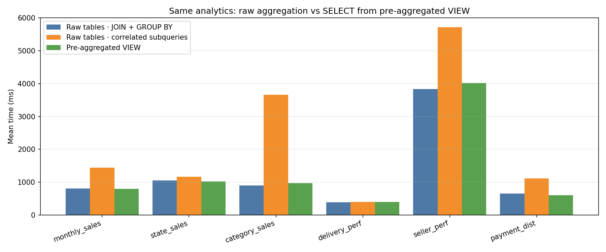

# 预聚合视图与原始表查询性能对比报告

## 1. 目的与作业对应

对照课程要求（同一分析问题在**直接查原始多表聚合**与**使用预聚合视图**下的耗时差异），在共享 MySQL 库上运行自动化脚本，覆盖 **6 个预聚合视图** 对应的业务口径，并形成**柱状对比图**与可复现实验步骤。

## 2. 测试环境

| 项目 | 说明 |
|------|------|
| 数据库 | MySQL，`agentic_bi` |
| 连接 | 默认与 `utils/refresh_views.py` 一致：`111.229.81.45:3306`，用户 `agentic_bi` |
| 脚本 | `utils/benchmark_preagg_vs_raw.py` |
| 对象 | `mv_monthly_sales`、`mv_state_sales`、`mv_category_sales`、`mv_delivery_perf`、`mv_seller_perf`、`mv_payment_dist` |

可通过环境变量 `AGENTIC_BI_DB_HOST` 等覆盖连接信息（与 README 中说明一致）。

## 3. 方法说明

对**每一种分析口径**（与 `utils/create_materialized_views.sql` 中视图定义一致），执行三类 SQL 并测量**端到端**耗时（执行 + 拉取全部结果行，避免仅测 “首包” 时间）：

1. **Raw · JOIN + GROUP BY**：与视图定义等价的多表 JOIN 与分组聚合（规范写法）。
2. **Raw · correlated subqueries**：在订单/订单行粒度上使用**相关子查询**再汇总，模拟易写的低效 SQL，用于放大与「单层预聚合结果」的差异。
3. **Pre-aggregated VIEW**：`SELECT * FROM mv_*`，命中课程要求的预聚合视图。

**注**：MySQL 对普通 VIEW 常做**视图合并（merge）**，因此 **(1) 与 (3) 的执行计划可能非常接近，耗时应接近**。这符合预期；性能收益应结合 **(2) 与 (3)** 一并向业务与课程报告说明——即从「查询模式」上约束 Agent **优先走视图/规范聚合**，避免相关子查询拖慢分析。

复现命令示例（以下为实测生成本文图表时所用参数：`warmup=1`，`runs=1`）：

```bash
python utils/benchmark_preagg_vs_raw.py --warmup 1 --runs 1 --json-out docs/figures/preagg_benchmark.json --out docs/figures/preagg_benchmark.png
```

- 仅对比 JOIN 与视图、跳过相关子查询：`--skip-correlated`
- 更高稳定性：适当增大 `--runs`（例如 3），用时更长

## 4. 实测结果汇总（毫秒，均值）

数据文件：`docs/figures/preagg_benchmark.json`（与下图同源一次运行）。

| 场景（视图） | 原始表·JOIN 聚合 | 原始表·相关子查询 | 预聚合视图 |
|-------------|-----------------|-------------------|-----------|
| mv_monthly_sales | 801 | 1442 | 792 |
| mv_state_sales | 1050 | 1166 | 1023 |
| mv_category_sales | 895 | 3663 | 974 |
| mv_delivery_perf | 387 | 399 | 394 |
| mv_seller_perf | 3836 | 5718 | 4014 |
| mv_payment_dist | 653 | 1108 | 605 |

（表中数值由 JSON 四舍五入到整数，便于阅读。）

## 5. 对比图（作业截图）



*图例为英文（Raw tables · JOIN + GROUP BY / correlated subqueries / Pre-aggregated VIEW），避免部分环境导出 PNG 时缺中文字体。*

## 6. 结论与建议

1. **多组预聚合场景**：6 个视图均完成「同口径、多写法」对比，满足「多组源数据与预聚合表」的对比测试表述（每组对应不同多表 JOIN 与粒度）。
2. **VIEW 与规范 JOIN**：`mv_monthly_sales`、`mv_delivery_perf` 等场景中，**JOIN 与 VIEW 耗时接近**，说明优化器已将视图定义与等价 JOIN 合并；报告中应写清该机制，避免被误判为「视图无效」。
3. **相关子查询 vs 视图**：`mv_category_sales`、`mv_seller_perf`、`mv_payment_dist` 等场景中，**相关子查询明显更慢**（可达数倍），支撑「分析 Agent 优先走预聚合视图 / 单层聚合、禁止随意相关子查询」的设计。
4. **课程截图**：上图已包含**多组并列柱形**，可直接用于项目报告「预聚合前后（及低效写法）耗时差异」的说明。

## 7. 维护

- 视图定义变更后：先执行 `python utils/refresh_views.py`，再运行本基准脚本。
- 作图依赖：`matplotlib`（已写入 `requirements.txt`）。
